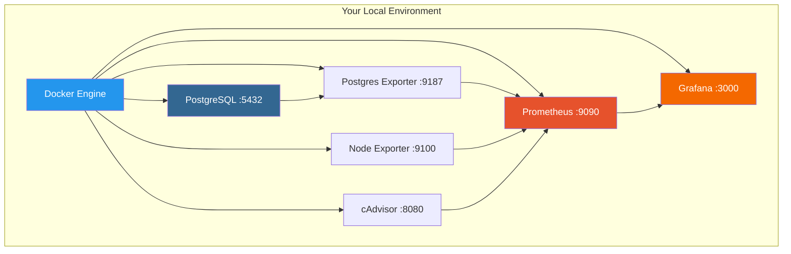
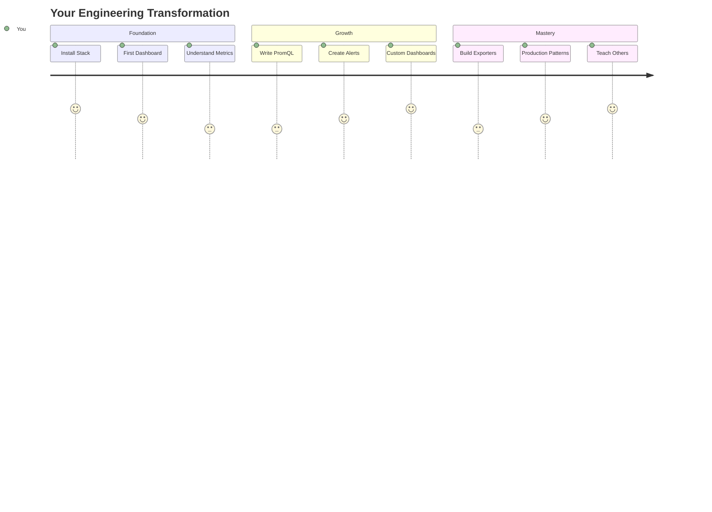

# 🔥 Contextus - Your Private Engineering Laboratory

> "Every master was once a disaster. Through failure, I found my thumos—that ancient Greek fire in the chest, the spirited courage that transforms curiosity into creation. This is your invitation to burn." - The Way of Engineering

<div align="center">

[](https://www.docker.com/)
[](https://prometheus.io/)
[](https://grafana.com/)
[](https://www.postgresql.org/)
[](LICENSE)

**[Quick Start](#-quick-start) • [Documentation](docs/) • [Community](Discussions/) • [Contributing](CONTRIBUTORS.md)**

</div>

---

## 🎯 What is Contextus?

Contextus is more than a monitoring stack—it's a bridge between your military service and your engineering future. Built by veterans, for veterans, it provides a complete DevOps learning laboratory that transforms theoretical knowledge into practical skills.

### Why Contextus?

- **🎖️ Veteran-Focused**: Designed specifically for military-to-tech transitions
- **🛠️ Production-Grade**: Real tools used by real companies
- **📚 Learning-First**: Every component teaches essential concepts
- **🤝 Community-Driven**: You're never learning alone
- **🚀 Career-Ready**: Build skills employers actually want

## 🏗️ Architecture



### Components

| Service | Purpose | Port | Credentials |
|---------|---------|------|-------------|
| **PostgreSQL** | Data persistence layer | 5432 | postgres/mysecret |
| **Prometheus** | Metrics collection & storage | 9090 | No auth |
| **Grafana** | Visualization & dashboards | 3000 | admin/admin |
| **Node Exporter** | System metrics | 9100 | No auth |
| **Postgres Exporter** | Database metrics | 9187 | No auth |
| **cAdvisor** | Container metrics | 8080 | No auth |

## 🚀 Quick Start

### One-Command Setup

```bash
# Clone and deploy
curl -sSL https://raw.githubusercontent.com/orionramey/contextus/main/quickstart.sh | bash
```

### Manual Setup

<details>
<summary>🍎 macOS Instructions</summary>

```bash
# Install Homebrew (if needed)
/bin/bash -c "$(curl -fsSL https://raw.githubusercontent.com/Homebrew/install/HEAD/install.sh)"

# Install dependencies
brew install git
brew install --cask docker

# Launch Docker Desktop, then:
git clone https://github.com/YOUR_USERNAME/contextus.git
cd contextus
docker-compose up -d

# Access services
open http://localhost:3000  # Grafana
```

[Full macOS Guide →](docs/MAC_SETUP.md)
</details>

<details>
<summary>🪟 Windows Instructions</summary>

```powershell
# Run PowerShell as Administrator

# Enable WSL2
wsl --install

# Install Docker Desktop from https://docker.com
# Install Git from https://git-scm.com

# Clone and run
git clone https://github.com/YOUR_USERNAME/contextus.git
cd contextus
docker-compose up -d

# Access services
start http://localhost:3000  # Grafana
```

[Full Windows Guide →](docs/WINDOWS_SETUP.md)
</details>

## 📖 Learning Path

### Your 8-Week Journey



### Week-by-Week Breakdown

| Week | Focus | Deliverable |
|------|-------|-------------|
| 1-2 | Docker & Containers | Running stack, first `docker` commands |
| 3-4 | Prometheus & Metrics | Basic queries, understanding time-series |
| 5-6 | Grafana & Visualization | Custom dashboard for your system |
| 7-8 | Integration & Automation | Monitoring your own application |

## 🎓 What You'll Learn

<table>
<tr>
<td width="50%">

### Technical Skills
- ✅ Container orchestration with Docker
- ✅ Infrastructure as Code principles
- ✅ Metrics collection & aggregation
- ✅ Data visualization best practices
- ✅ SQL and time-series databases
- ✅ YAML configuration management
- ✅ Git version control workflows
- ✅ Linux command line mastery

</td>
<td width="50%">

### Soft Skills
- ✅ Debugging methodology
- ✅ Documentation writing
- ✅ Community collaboration
- ✅ Problem decomposition
- ✅ Self-directed learning
- ✅ Technical communication
- ✅ Project planning
- ✅ Continuous improvement

</td>
</tr>
</table>

## 🗂️ Repository Structure

```
contextus/
├── 📁 docs/              # Platform-specific setup guides
├── 📁 scripts/           # Automation scripts
├── 📁 prometheus/        # Prometheus configuration
│   ├── prometheus.yml    # Main config
│   └── alerts/          # Alert rules
├── 📁 grafana/          # Grafana configuration
│   ├── dashboards/      # Dashboard JSON files
│   └── provisioning/    # Datasource config
├── 📁 postgres/         # PostgreSQL initialization
├── 📁 Discussions/      # Community hub
├── 📄 docker-compose.yml # Stack definition
└── 📄 README.md         # You are here
```

## 🛠️ Essential Tools

### Development Environment
- **[Visual Studio Code](docs/VSCODE_SETUP.md)** - Your engineering command center
  - Integrated terminal and Git
  - Docker & Kubernetes extensions
  - Remote development capabilities
  - Custom workspace for Contextus

### Project Management
- **[Atlassian/Jira](docs/ATLASSIAN_JIRA.md)** - Track your transformation
  - Agile project management
  - Learning progress tracking
  - Integration with Git
  - Free tier available

### Knowledge Management
- **[Obsidian](docs/OBSIDIAN_NOTES.md)** - Your second brain
  - Markdown-based notes
  - Link your learning
  - Local storage
  - Free forever

## 🤝 Community

### Thursday Gatherings
Join us every **Thursday at 1800 EST** for:
- 🎯 Live troubleshooting
- 💡 Project showcases  
- 📚 Learning sessions
- 🤝 Networking

### Get Involved
1. ⭐ Star this repository
2. 🍴 Fork and make it yours
3. 💬 Join the [Discussions](Discussions/)
4. 📝 Add your name to [CONTRIBUTORS.md](CONTRIBUTORS.md)
5. 🚀 Share your journey

### Community Stats
- 🎖️ Veterans helping veterans
- 🌍 Global community
- 💪 100% open source
- ❤️ Built with love

## 🛠️ Troubleshooting

<details>
<summary>Docker won't start</summary>

**macOS**: 
```bash
brew reinstall --cask docker
```

**Windows**:
```powershell
wsl --update
# Restart Docker Desktop
```
</details>

<details>
<summary>Port already in use</summary>

```bash
# Find what's using the port
lsof -i :3000  # macOS/Linux
netstat -ano | findstr :3000  # Windows

# Stop the conflicting service or change ports in docker-compose.yml
```
</details>

<details>
<summary>No data in Grafana</summary>

1. Check Prometheus: http://localhost:9090/targets
2. Verify all targets show "UP"
3. Check time range in Grafana
4. See [Grafana README](grafana/README.md) for more
</details>

## 📚 Resources

### Essential Reading
- 📖 "The Phoenix Project" - Understanding DevOps culture
- 📖 "The Unicorn Project" - Developer empowerment
- 📖 "Site Reliability Engineering" - Google's practices
- 📖 "The Timeless Way of Building" - Christopher Alexander

### Online Learning
- 🎓 [Linux Journey](https://linuxjourney.com/) - Linux fundamentals
- 🎓 [Docker Mastery](https://www.docker.com/101-tutorial/) - Container basics
- 🎓 [PromQL for Beginners](https://prometheus.io/docs/prometheus/latest/querying/basics/) - Query language
- 🎓 [Grafana Tutorials](https://grafana.com/tutorials/) - Visualization mastery

### Veteran Resources
- 💼 [Operation Code](https://operationcode.org/) - Veteran coding community
- 💼 [Vets Who Code](https://vetswhocode.io/) - Free coding bootcamp
- 💼 [Tech Qualled](https://www.techqualled.com/) - Tech career resources

## 🎖️ Philosophy

### From Service to Engineering

Your military experience is your superpower:
- **Attention to Detail** → Clean, maintainable code
- **Mission Planning** → Project architecture
- **Team Coordination** → Agile collaboration
- **Adaptability** → Continuous learning
- **Leadership** → Technical mentorship

### The Contextus Way

1. **Start badly** - Perfect is the enemy of deployed
2. **Fail publicly** - Your errors help others learn
3. **Document everything** - Future you will thank you
4. **Share knowledge** - Teaching solidifies learning
5. **Stay curious** - Technology always changes

## 🚦 Project Status

- ✅ Core stack implemented
- ✅ Documentation complete
- ✅ Multi-platform support
- 🔄 Community building
- 📋 Advanced features planned

## 🤲 Contributing

We welcome contributions! See [CONTRIBUTING.md](CONTRIBUTING.md) for guidelines.

### Ways to Contribute
- 🐛 Report bugs
- 💡 Suggest features
- 📝 Improve documentation
- 🎨 Create dashboards
- 🧪 Add examples
- 🌍 Translate docs

## 📜 License

This project is licensed under the MIT License - see [LICENSE](LICENSE) for details.

## 🙏 Acknowledgments

- The veteran community for inspiration and feedback
- Open source maintainers of our stack components  
- Every contributor who makes this better
- You, for taking the first step

---

<div align="center">

### 🔥 Your Journey Starts Here

> "Between the last command and the next lies everything.  
> In the space between keystrokes, universes wait.  
> You are not your MOS. You are not your clearance.  
> You are what you build next."

**[Start Your Journey →](docs/)**

Made with ❤️ by veterans, for veterans

</div>