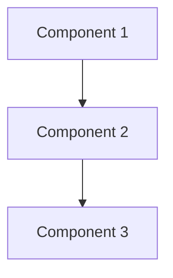

# 🎯 Atlassian Suite & Change Management

> "In the military, we tracked missions. In engineering, we track changes. Same discipline, better tools."

## 🌟 Why Atlassian?

The Atlassian suite is the industry standard for a reason:
- **Jira** - Track work, not just tickets
- **Confluence** - Knowledge that grows with your team
- **Bitbucket** - Code with context
- **Trello** - Visual simplicity when needed

Think of it as your digital command center—where strategy meets execution.

## 🎯 Jira: From Tickets to Transformation

### What Makes Jira Different

Military systems track compliance. Jira tracks progress:
- **Stories over Requirements** - Focus on user value
- **Sprints over Schedules** - Deliver incrementally  
- **Boards over Reports** - Visualize flow
- **Collaboration over Control** - Everyone contributes

### Core Concepts

#### Issues (Your New Orders)
```
Epic        → Strategic objective (Campaign)
  Story     → User-facing feature (Mission)
    Task    → Technical work (Operation)
      Sub-task → Specific steps (Tasks)
Bug         → Defect to fix (Incident)
```

#### Workflow (Your Battle Rhythm)
```
To Do → In Progress → Code Review → Testing → Done
  ↑                                              ↓
  └──────────── Blocked/Reopened ←──────────────┘
```

### Setting Up Your First Project

#### 1. Create a Personal Project
Perfect for tracking your learning:

```
Project: Contextus Learning Journey
Key: CLJ
Type: Kanban (start simple)

Columns:
- Backlog (Learning goals)
- This Week (Current focus)
- In Progress (Actively learning)
- Review (Practice/reinforce)
- Mastered (Completed skills)
```

#### 2. Create Learning Stories
```yaml
Story: Learn Docker Fundamentals
Acceptance Criteria:
  - Can explain containers vs VMs
  - Successfully run Contextus stack
  - Create custom Dockerfile
  - Understand networking basics

Tasks:
  - Complete Docker tutorial
  - Read Docker documentation
  - Build custom image
  - Document learnings
```

#### 3. Track Your Progress
```yaml
Story: Master PromQL
Story Points: 8
Sprint: Week 3-4

Description: |
  As a new engineer
  I want to master PromQL
  So that I can create meaningful queries

Tasks:
  - [ ] Basic selectors and matchers
  - [ ] Rate and increase functions
  - [ ] Aggregation operators
  - [ ] Create 10 useful queries
  - [ ] Build custom dashboard
```

### Jira Query Language (JQL)

Your new search superpower:

```sql
-- Find my active work
assignee = currentUser() AND status != Done

-- This week's learning
project = CLJ AND sprint in openSprints()

-- Blocked items needing attention
status = Blocked AND assignee = currentUser()

-- Recently completed victories
status changed to Done after -7d

-- High priority items
priority in (High, Highest) AND status != Done
```

### Agile Boards

#### Kanban Board (Start Here)
- **Visual flow** - See everything at once
- **WIP limits** - Don't overcommit
- **Continuous flow** - No sprint pressure

#### Scrum Board (Level Up)
- **Sprint planning** - 2-week commitments
- **Velocity tracking** - Measure improvement
- **Retrospectives** - Continuous learning

### Integration with Development

#### Git Integration
Link commits to Jira:
```bash
git commit -m "CLJ-123: Add Prometheus alerts for database monitoring"
```

#### Smart Commits
Do more with commit messages:
```bash
git commit -m "CLJ-123 #time 2h #comment Added CPU usage alerts #done"
```

#### Automation Rules
Set up smart automation:
```yaml
When: Pull Request Merged
If: Branch name contains issue key
Then: 
  - Transition issue to "Done"
  - Add comment with PR link
  - Log time from PR description
```

## 📚 Confluence: Your Digital Brain

### Why Documentation Matters

> "The palest ink is better than the best memory." - Chinese Proverb

In the military, we wrote After Action Reports. In engineering, we write documentation:
- **Future you** will thank present you
- **Team members** can learn from your journey
- **Knowledge** compounds over time

### Confluence Structure

```
Space: Engineering Journey
  📁 Getting Started
    📄 Environment Setup
    📄 Tool Configurations
    📄 Troubleshooting Guide
  
  📁 Learning Notes
    📄 Docker Concepts
    📄 Prometheus Queries
    📄 Grafana Best Practices
  
  📁 Projects
    📄 Contextus Setup
    📄 Custom Dashboards
    📄 Automation Scripts
  
  📁 Resources
    📄 Useful Links
    📄 Book Notes
    📄 Course Reviews
```

### Page Templates

#### Daily Learning Journal
```markdown
# Date: {{date}}

## What I Learned
- Key concept 1
- Key concept 2

## Challenges Faced
- Issue: [Description]
  Solution: [How I solved it]

## Tomorrow's Goals
- [ ] Goal 1
- [ ] Goal 2

## Resources Used
- [Link 1](url)
- [Link 2](url)

## Thumos Level: 8/10
```

#### Project Documentation
```markdown
# Project: {{Project Name}}

## Overview
Brief description of what this project does

## Architecture


## Setup Instructions
1. Step 1
2. Step 2

## Configuration
```yaml
key: value
```

## Troubleshooting
| Issue | Solution |
|-------|----------|
| Error 1 | Fix 1 |

## Lessons Learned
- Insight 1
- Insight 2
```

### Confluence Best Practices

1. **Page Hierarchy**
   - Parent pages for topics
   - Child pages for details
   - Labels for cross-linking

2. **Rich Content**
   - Use macros for dynamic content
   - Embed diagrams and videos
   - Include code blocks

3. **Collaboration**
   - @mention for feedback
   - Comments for discussion
   - Watch pages for updates

## 🔄 Change Management Philosophy

### From Military to Agile

| Military | Agile Engineering |
|----------|-------------------|
| Orders from above | Self-organizing teams |
| Detailed planning | Adaptive planning |
| Risk avoidance | Fail fast, learn fast |
| Following procedure | Innovating solutions |
| Individual accountability | Collective ownership |

### The Three Pillars

#### 1. Visibility
- Everyone sees the work
- Progress is transparent
- Blockers surface quickly

#### 2. Accountability
- Own your commitments
- Update status regularly
- Ask for help early

#### 3. Continuous Improvement
- Regular retrospectives
- Measure and adjust
- Celebrate learning

## 🛠️ Practical Jira Workflows

### For Learning Projects

```yaml
Workflow: Learning Flow
States:
  - To Learn (Backlog)
  - Researching (Active learning)
  - Practicing (Hands-on work)
  - Documenting (Capture knowledge)
  - Mastered (Complete)

Transitions:
  Start Learning: To Learn → Researching
  Begin Practice: Researching → Practicing
  Document: Practicing → Documenting
  Complete: Documenting → Mastered
  Need More Research: Any → Researching
```

### For Development Work

```yaml
Workflow: Development Flow
States:
  - To Do
  - In Development
  - Code Review
  - Testing
  - Ready for Deploy
  - Done

Transitions:
  Start Work: To Do → In Development
  Request Review: In Development → Code Review
  Approve: Code Review → Testing
  Request Changes: Code Review → In Development
  Pass Tests: Testing → Ready for Deploy
  Deploy: Ready for Deploy → Done
```

## 📊 Metrics That Matter

### Velocity Tracking
- Story points completed per sprint
- Trend over time
- Identify sustainable pace

### Cycle Time
- How long from start to done?
- Where are bottlenecks?
- Continuous flow optimization

### Learning Metrics
```sql
-- Weekly learning velocity
project = CLJ 
  AND resolved >= -1w 
  AND type = Story

-- Knowledge gap analysis
project = CLJ 
  AND labels in (docker, prometheus, grafana) 
  AND status != Done
  GROUP BY labels
```

## 🎯 Getting Started with Free Tier

### Option 1: Atlassian Cloud (Free)
- Up to 10 users
- 2GB storage
- Basic features
- Perfect for learning

### Option 2: Open Source Alternatives
- **Jira Alternative**: [Taiga](https://taiga.io/), [WeKan](https://wekan.github.io/)
- **Confluence Alternative**: Your Obsidian vault (see next section)
- **Integration**: GitHub Projects + Wiki

### Option 3: Student/Veteran Discounts
- Check for educational licenses
- Veteran-owned business discounts
- Open source project licenses

## 💡 Pro Tips

### Jira Hacks
1. **Bulk Operations**: Select multiple issues → Actions
2. **Quick Filters**: Save JQL queries
3. **Keyboard Shortcuts**: 
   - `c` - Create issue
   - `g` then `g` - Go to dashboard
   - `/` - Quick search

### Confluence Power Users
1. **Page Templates**: Create once, reuse forever
2. **Macros**: Dynamic content (status, charts)
3. **Spaces**: Organize by project or topic
4. **Search**: Use advanced search operators

### Integration Magic
- Slack notifications for status changes
- Calendar sync for sprint events
- IDE plugins for quick updates
- Mobile apps for on-the-go

## 🎓 Your First Week Challenge

### Day 1-2: Setup
- [ ] Create free Atlassian account
- [ ] Set up first Jira project
- [ ] Create Confluence space

### Day 3-4: Configure
- [ ] Design your workflow
- [ ] Create issue types
- [ ] Set up board views

### Day 5-6: Use
- [ ] Create 10 learning stories
- [ ] Move items through workflow
- [ ] Document in Confluence

### Day 7: Reflect
- [ ] Review metrics
- [ ] Adjust workflow
- [ ] Plan next sprint

## 🌟 Remember

> "A good system shortens the road to the goal." - Orison Swett Marden

Jira isn't about micromanagement—it's about macro-visibility. It transforms chaos into clarity, letting you focus on what matters: building.

---

*Start simple. One project, one board, one workflow. Master the basics before adding complexity.*