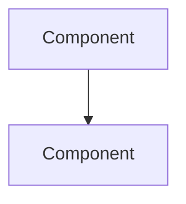

# 🧠 Obsidian: Your Second Brain

> "Your mind is for having ideas, not holding them." - David Allen

## 🎯 Why Obsidian?

In the military, we kept green notebooks. In engineering, we keep digital gardens:
- **Markdown-based** - Future-proof, portable notes
- **Linked thinking** - Ideas connect like neurons
- **Local storage** - Your data, your control
- **Free forever** - Core features cost nothing
- **Extensible** - Plugins for everything

Think of Obsidian as your personal Wikipedia—where every thought has a home and every connection has meaning.

## 🚀 Quick Start

### Installation
1. Download from [obsidian.md](https://obsidian.md)
2. Create a vault called "Engineering Journey"
3. Start writing in markdown

### Your First Vault Structure
```
📁 Engineering Journey/
├── 📁 Daily Notes/
│   └── 📄 2024-01-15.md
├── 📁 Projects/
│   └── 📄 Contextus Setup.md
├── 📁 Learning/
│   ├── 📄 Docker.md
│   ├── 📄 Prometheus.md
│   └── 📄 Grafana.md
├── 📁 Resources/
│   ├── 📄 Commands.md
│   ├── 📄 Troubleshooting.md
│   └── 📄 Links.md
├── 📁 Reflections/
│   └── 📄 Week 1 Retrospective.md
└── 📄 README.md
```

## 📝 Note-Taking Philosophy

### The Zettelkasten Method
Perfect for engineering learning:

1. **Atomic Notes** - One concept per note
2. **Unique IDs** - Timestamp or number each note
3. **Linking** - Connect related ideas
4. **No Hierarchy** - Let structure emerge

### Daily Notes Template
```markdown
# {{date:YYYY-MM-DD}}

## 🎯 Today's Focus
- [ ] Main goal
- [ ] Secondary goal
- [ ] Nice to have

## 📚 Learning Log
### What I Studied
- Topic: 
- Time spent: 
- Resources used:

### Key Insights
1. 
2. 
3. 

### Questions Raised
- 
- 

## 💻 Code Snippets
```language
// Interesting code from today
```

## 🔧 Problems & Solutions
| Problem | Solution | Lesson |
|---------|----------|--------|
| | | |

## 🔗 Links Created
- [[Concept]] - Why it matters
- [[Project]] - How it connects

## 🌟 Thumos Level: /10
Energy and passion for learning today

## 📅 Tomorrow's Priority
- 

---
Tags: #daily #learning #contextus
```

## 🔗 Linking Your Knowledge

### Wiki-Style Links
Connect ideas naturally:
```markdown
Today I learned about [[Docker Containers]], which are different 
from [[Virtual Machines]]. This is crucial for understanding 
[[Microservices Architecture]].

The [[Prometheus]] metrics are stored in a [[Time Series Database]], 
which is optimized for [[Observability]] use cases.
```

### Backlinks
See where concepts are referenced:
- Each note shows incoming links
- Discover unexpected connections
- Build knowledge networks

### Tags for Organization
```markdown
#docker #prometheus #grafana #learning #troubleshooting
#project/contextus #week1 #solved #question
```

## 💎 Essential Plugins

### Core Toolkit
1. **Calendar** - Navigate daily notes
2. **Templates** - Consistent note structure
3. **Dataview** - Query your notes like a database
4. **Kanban** - Visual task management
5. **Git** - Version control your vault

### Power User Plugins
- **Excalidraw** - Visual diagrams
- **Mermaid** - Code-based diagrams
- **Advanced Tables** - Easy table editing
- **Highlightr** - PDF annotations
- **Periodic Notes** - Weekly/monthly reviews

## 📊 Engineering-Specific Templates

### Project Template
```markdown
# Project: {{title}}

## Overview
- **Start Date**: {{date}}
- **Status**: Planning/Active/Complete
- **Repository**: [GitHub Link]()

## Objectives
1. 
2. 
3. 

## Architecture


## Setup Steps
- [ ] Step 1
- [ ] Step 2

## Configuration
```yaml
key: value
```

## Challenges & Solutions
### Challenge 1
- **Problem**: 
- **Solution**: 
- **Learning**: 

## Resources
- [[Related Concept]]
- [External Link]()

## Retrospective
- What went well:
- What could improve:
- Key learnings:

---
Tags: #project #status/active
```

### Learning Module Template
```markdown
# Technology: {{name}}

## Overview
Brief description and why it matters

## Key Concepts
- **Concept 1**: Definition
- **Concept 2**: Definition

## Installation
```bash
# Commands
```

## Basic Usage
```code
// Examples
```

## Common Patterns
### Pattern 1
When to use and example

## Troubleshooting
| Error | Cause | Solution |
|-------|-------|----------|
| | | |

## Resources
- Official Docs: 
- Tutorial: 
- Video: 

## Practice Projects
- [ ] Project idea 1
- [ ] Project idea 2

## Questions
- [ ] Unanswered question 1
- [ ] Research topic

---
Related: [[Parent Topic]] [[Similar Tech]]
Tags: #technology #learning
```

### Troubleshooting Log
```markdown
# Issue: {{description}}
**Date**: {{date}}
**Context**: Working on [[Project Name]]

## Error Message
```
Paste exact error
```

## Environment
- OS: 
- Version: 
- Related tools: 

## What I Tried
1. Attempt 1
   - Result: 
2. Attempt 2
   - Result: 

## Solution
```bash
# Working solution
```

## Root Cause
Explanation of why this happened

## Prevention
How to avoid this in future

## Related Issues
- [[Similar Problem]]
- [Stack Overflow Link]()

---
Tags: #troubleshooting #solved #docker
```

## 🎯 Obsidian for Engineers

### Code Snippet Management
```markdown
# Useful Commands

## Docker
```bash
# View logs
docker logs -f container_name

# Enter container
docker exec -it container_name bash
```

## Git
```bash
# Undo last commit
git reset --soft HEAD~1
```

## PostgreSQL
```sql
-- Check connections
SELECT count(*) FROM pg_stat_activity;
```
```

### Meeting Notes
```markdown
# Meeting: {{title}}
**Date**: {{date}}
**Attendees**: 
**Purpose**: 

## Agenda
1. 
2. 

## Discussion
### Topic 1
- Point
- Decision: 

## Action Items
- [ ] @Me: Task by date
- [ ] @Other: Their task

## Follow-up
Next meeting: 

---
Tags: #meeting #team
```

## 🔥 Power User Tips

### Search Operators
- `path:` - Search in specific folders
- `tag:` - Find by tag
- `file:` - Search filenames
- `-` - Exclude terms
- `"exact phrase"` - Exact match

### Keyboard Shortcuts
- `Cmd/Ctrl + O` - Quick open
- `Cmd/Ctrl + P` - Command palette
- `Cmd/Ctrl + E` - Toggle edit/preview
- `Alt + Enter` - Follow link in new pane
- `Cmd/Ctrl + Shift + F` - Search vault

### Graph View
- Visualize note connections
- Identify knowledge gaps
- Find orphaned notes
- Color by tags

## 📱 Mobile Sync

### Options
1. **iCloud/Google Drive** - Simple but limited
2. **Obsidian Sync** - Paid but seamless
3. **Git** - Free but technical
4. **Syncthing** - Open source P2P

### Mobile Workflow
- Quick capture on phone
- Process on desktop
- Review anywhere

## 🌱 Growing Your Digital Garden

### Daily Practice
1. **Morning**: Review yesterday's notes
2. **Throughout**: Capture thoughts immediately
3. **Evening**: Process and link notes

### Weekly Review
```markdown
# Week {{week}} Review

## Accomplishments
- 
- 

## Learnings
### Technical
- 

### Soft Skills
- 

## Challenges
- 

## Next Week Focus
1. 
2. 
3. 

## Notes Created
- [[Note 1]]: Brief description
- [[Note 2]]: Brief description

## Metrics
- Notes created: 
- Links made: 
- Projects advanced: 
```

## 🎓 From Notes to Knowledge

### The Feynman Technique
1. Write concept as if teaching a child
2. Identify gaps in understanding
3. Research and simplify
4. Create analogies

### Progressive Summarization
1. **Layer 1**: Save interesting content
2. **Layer 2**: Bold important parts
3. **Layer 3**: Highlight crucial insights
4. **Layer 4**: Create summary note
5. **Layer 5**: Add to master index

## 💡 Integration Ideas

### With Your Stack
- Export Grafana dashboards → Document in Obsidian
- PromQL queries → Code snippet notes
- Docker commands → Troubleshooting log
- Learning progress → Daily notes

### With Other Tools
- Jira tickets → Project notes
- Confluence → Knowledge base
- GitHub issues → Problem solving log
- Stack Overflow → Solution database

## 🚀 Your First Week

### Day 1: Setup
- [ ] Install Obsidian
- [ ] Create vault structure
- [ ] Install essential plugins

### Day 2-3: Templates
- [ ] Create daily note template
- [ ] Create project template
- [ ] Set up hotkeys

### Day 4-5: Capture
- [ ] Take notes during learning
- [ ] Link related concepts
- [ ] Tag appropriately

### Day 6-7: Review
- [ ] Create first weekly review
- [ ] Identify patterns
- [ ] Plan improvements

## 🌟 Remember

> "Building a second brain is not about remembering more; it's about thinking better."

Your Obsidian vault is a living document of your engineering journey. Every note is a stepping stone, every link a bridge, every tag a signpost on your path from veteran to engineer.

---

*Start with one note. Link to another. Watch your knowledge grow.*